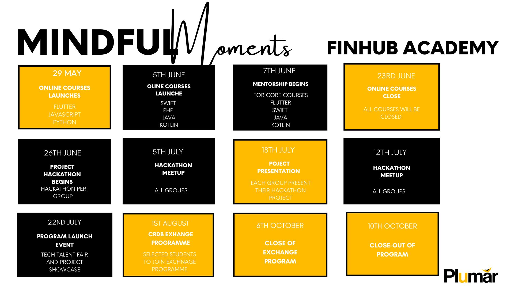

# finhubtalentdevelopers program

## About the program 

This repo servers as a documentation for the finhub talent developers program and building of the developers community.

The partnership between CRDB Bank and the University of Dar Es Salaam aims to train 70 students in high-demand software engineering skills. The program, called FINHUB Developers Academy, focuses on providing a platform for students to learn software engineering skills and connect them to job opportunities, with priority given to CRDB's job pool.

The program consists of several components. It starts with a 1-day onboarding workshop where students are familiarized with the program plan. They also undergo technical and personality assessments to determine their proficiency levels and assist in talent planning. Based on their proficiency and specialization preferences, students are assigned relevant software programming training.

The training utilizes the Challenge-Based Learning (CBL) model, which fosters creative and collaborative approaches to improve coding skills. The curriculum is designed based on competency and personality assessments, ensuring a tailored learning experience. The program covers various programming languages, including UI/UX, JAVA, Springboot, Kotlin, Objective-C, SWIFT, and JavaScript frameworks.

To support students in applying their knowledge, expert mentors are assigned to each group. These mentors provide technical guidance and ensure that students critically work on their project tasks with high-quality standards. Weekly touch points are established between mentors and students over a period of 2 months.

Upon completion of the challenge-based software development training and mentorship, the program organizes a launch event. During this event, students showcase their acquired tech skills through a tech talent fair and participate in a DevHack pitch session, where they present their tech solutions developed during the program.

Selected students also have the opportunity to participate in a 2-month exchange program at CRDB Bank. This program offers professional capacity building in a corporate setting, where students work on projects and are assessed based on their performance.

The expected outcomes of the program include 70 students acquiring new programming skills, 25 students joining CRDB's tech talent pipeline through the exchange program, the development of two tech platforms to support CRDB Bank's internal programs, and the operationalization of eight tech solutions developed by the students. Additionally, the program aims to launch the CRDB developers community, providing onboarded students with connections to job opportunities.

## The Program Calendar

## Program Resources

- [progran concept note](assets/pdfs/FINHUB%20Developer%20Academy%20.pdf)
- [detailed activity plan](https://docs.google.com/spreadsheets/d/1YXQM53lbHBfDf87g1IEKSJLtsy9V1i6i/edit#gid=256693332)